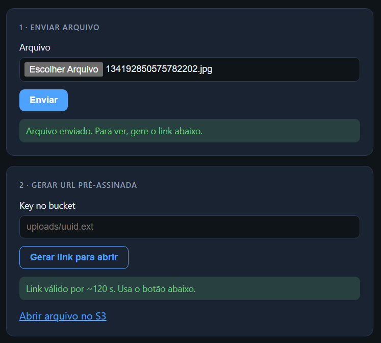
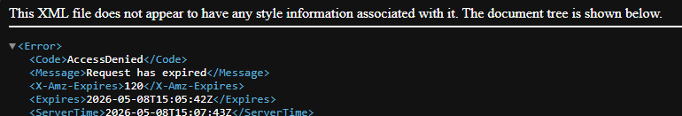

# S3 Upload API — projeto de estudo

Projeto que eu fiz pra aprender **NestJS + S3**. Ideia: você faz upload de um arquivo pro bucket e depois pede uma **URL pré-assinada** que expira em tipo **2 minutos**. 

## Por que existe?

Arquivo privado no S3 + link temporário pra baixar/ver sem deixar o bucket público.

## O que tem aqui

- API Nest (`POST /upload`, `GET /upload/url?key=...`)
- Uma **telinha HTML** em `http://localhost:3000/` pra testar — fluxo simples: upload e depois gerar link 

## Como fica (screenshots)

Fluxo na página local — enviar arquivo e pedir link temporário:



Quando o link expira (~2 min), o S3 devolve algo assim no browser:



## Antes de rodar

- Node instalado
- Um bucket S3 na AWS + usuário IAM com permissão de `PutObject` e `GetObject` naquele bucket
- Copia o `.env.example` pra `.env` e preenche com tuas credenciais/região


## Como rodar

```bash
npm install
npm run start:dev
```

Abre o navegador em **http://localhost:3000/** ou testa a API com Insomnia/Postman/curl.

## Variáveis de ambiente

Vê o `.env.example` — é só região, nome do bucket e chaves IAM.

## Licença

MIT
